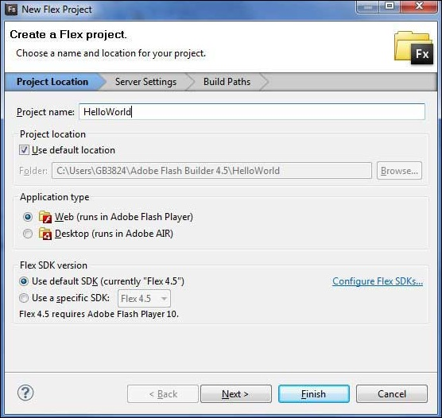
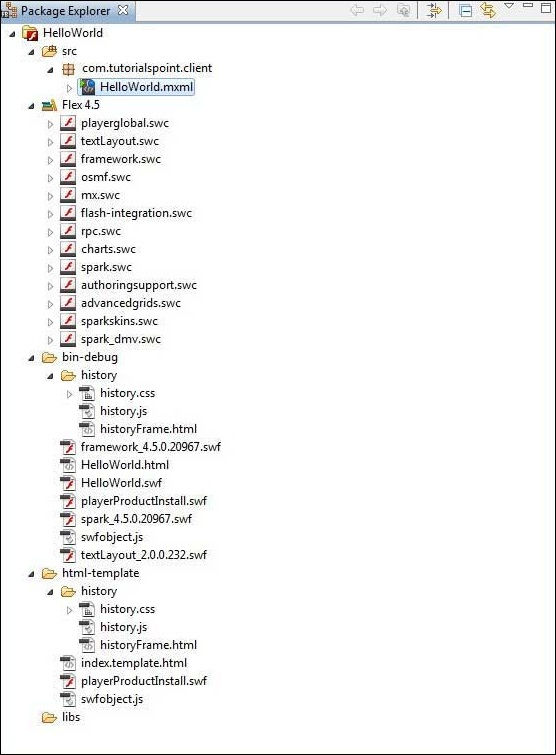
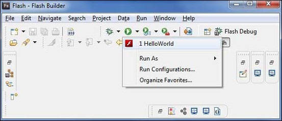
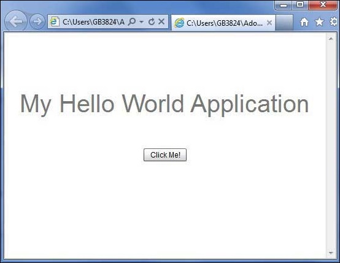

Flex - Create Application
=========================

.. toctree::
   :maxdepth: 3
   :caption: flex_applications

We'll use Flash Builder 4.5 to create Flex Applications. Let's start with a simple HelloWorld application.

Step 1 – Create Project
***********************

The first step is to create a simple Flex Project using Flash Builder IDE. Launch project wizard using the option **File > New > Flex Project**. Now name your project as HelloWorld using the wizard window as follows −

Select Application Type **Web** (runs in ``Adobe Flash Player``). However, if this is not selected, then leave other default values as such and click Finish Button. Once your project is created successfully, then you will have the following content in your Project Explorer −

Here is a brief description of all the important folders −

======================= ===========
Folder	                Location
======================= ===========
table table-bordered    Source code (mxml / as classes) files.
                        
                        We've created com/tutorialspoint/client folder structure containing the client-side specific java classes responsible for client UI display.

bin-debug               This is the output part, it represents the actual deployable web application.
                        History folder contains support files for history management of Flex application.

                        ``framework_xxx.swf``, flex framework files should be used by flex application.

                        ``HelloWorld.html``, wrapper/host HTML File for flex application.

                        ``HelloWorld.swf``, our flex based application.

                        ``playerProductInstall.swf``, flash player express installer.

                        ``spark_xxx.swf``, library for spark component support.

                        ``swfobject.js``, JavaScript responsible to load HelloWorld.swf in HelloWorld.html. It checks flash player version and passes initialization parameter to HelloWorld.swf file.

                        ``textLayout_xxx.swf``, library for text component support.

html-template           This represents the configurable web application. Flash Builder compiles files from html-template to bin-debug folder.

                        History folder contains support files for history management of Flex application.

                        ``index.template.html``, wrapper/host HTML File for flex application having place holders for Flash Builder specific configuration. Gets compiled to HelloWorld.html in bin-debug folder during build.

                        ``playerProductInstall.swf``, flash player express installer gets copied to bin-debug folder during build.

                        ``swfobject.js``, JavaScript responsible to load HelloWorld.swf in HelloWorld.html. It checks flash player version and passes initialization parameter to HelloWorld.swf file gets copied to bindebug folder during build.
======================= ===========

Step 2 – Create External CSS File
*********************************

Create a CSS file ``styles.css`` for Wrapper HTML page in ``html-template`` folder.

.. code:: css

    html, body { 
        height:100%;
    }

    body { 
        margin:0; 
        padding:0; 
        overflow:auto; 
        text-align:center;		
    }   

    object:focus { 
        outline:none; 
    }

    #flashContent { 
        display:none;	
    }

    .pluginHeader {
        font-family:Arial, Helvetica, sans-serif;
        font-size:14px;
        color:#9b1204;
        text-decoration:none;
        font-weight:bold;
    }

    .pluginInstallText {
        font-family:Arial, Helvetica, sans-serif;
        font-size:12px;
        color:#000000;
        line-height:18px;
        font-style:normal;
    }

    .pluginText { 
        font-family:Arial, Helvetica, sans-serif;
        font-size:12px;
        color:#000000;
        line-height:18px;
        font-style:normal;
    }

Step 3 – Modify Wrapper HTML page template
******************************************

Modify Wrapper HTML page template ``index.template.html`` in ``htmltemplate`` folder. Flash Builder will create a default Wrapper HTML page template ``html-template/index.template.html``, which will be compiled to HelloWorld.html.

This file contains placeholders which Flash Builder replaces during the compilation process. For example, flash player version, application name, etc.

Let us modify this file to display custom messages in case flash plugin is not installed.

.. code:: html

    <!DOCTYPE html PUBLIC "-//W3C//DTD XHTML 1.0 Transitional//EN"
    "http://www.w3.org/TR/xhtml1/DTD/xhtml1-transitional.dtd">
    <html xmlns = "http://www.w3.org/1999/xhtml" lang = "en" xml:lang = "en">
    
    <head>
        <title>${title}</title>
        <meta name = "google" value = "notranslate" />
        <meta http-equiv = "Content-Type" content = "text/html; charset = utf-8" />
        <link rel = "stylesheet" href = "styles.css" type = "text/css"></link>
        <link rel = "stylesheet" type = "text/css" href = "history/history.css" />
        
        
        
        
    </head>
    
    <body>
        

            

                <table width = "700" cellpadding = "10" cellspacing = "2" border = "0">
                <tr>
                    <td class = "pluginHeader">Flash Player Required</td>
                </tr>
                
                <tr>
                    <td class = "pluginText">The Adobe Flash Player version
                        10.2.0 or greater is required.</td>
                </tr>
                
                <tr>
                    <td class = "pluginInstallText" align = "left">
                
                    <table border = "0" width = "100%">
                        <tr class = "pluginInstallText" >
                            <td>Click here to download and install Adobe Flash Player:</td>
                            <td> </td>
                            <td align = "right">
                            
                            </td>
                        </tr>
                    </table>
                </tr>
                </table>
            

        

        
        <noscript>
            <object classid = "clsid:D27CDB6E-AE6D-11cf-96B8-444553540000"
                width = "${width}" height = "${height}" id = "${application}">
                <param name = "movie" value = "${swf}.swf" />
                <param name = "quality" value = "high" />
                <param name = "bgcolor" value = "${bgcolor}" />
                <param name = "allowScriptAccess" value = "sameDomain" />
                <param name = "allowFullScreen" value = "true" />
            
                <!--[if !IE]>-->
                <object type = "application/x-shockwave-flash" data = "${swf}.swf"
                width = "${width}" height = "${height}">
                <param name = "quality" value = "high" />
                <param name = "bgcolor" value = "${bgcolor}" />
                <param name = "allowScriptAccess" value = "sameDomain" />
                <param name = "allowFullScreen" value = "true" />
                <!--<![endif]-->
            
                <!--[if gte IE 6]>-->
                

                    

                        <table width = "700" cellpadding = "10" cellspacing = "2" 
                            border = "0">
                            <tr>
                            <td class = "pluginHeader">Flash Player Required</td>
                            </tr>
                            
                            <tr>
                            <td class = "pluginText">The Adobe Flash Player version
                            10.2.0 or greater is required.</td>
                            </tr>
                            
                            <tr>
                            <td class = "pluginInstallText" align = "left">

                            <table border = "0" width = "100%">
                                <tr class = "pluginInstallText" >
                                    <td>Click here to download and install Adobe Flash 
                                        Player:</td>
                                    <td> </td>
                                    <td align = "right">
                                        
                                    </td>
                                </tr>
                            </table>
                            </tr>
                        </table>
                    

                

                <!--<![endif]-->
            
                

                <table width = "700" cellpadding = "10" cellspacing = "2" border = "0">
                    <tr><td class = "pluginHeader">Flash Player Required</td></tr>
                    <tr><td class = "pluginText">The Adobe Flash Player version
                        10.2.0 or greater is required.</td></tr>
                    <tr>
                        <td class = "pluginInstallText" align = "left">
                            <table border = "0" width = "100%">
                            <tr class = "pluginInstallText" >
                                <td>Click here to download and install Adobe Flash 
                                    Player:</td>
                                <td> </td>
                                <td align = "right">
                                    
                                </td>
                            </tr>
                            </table>
                        </td>
                    </tr>
                </table>
                

            <!--[if !IE]>-->
            </object>
            <!--<![endif]-->
            </object>
        </noscript>
    </body>
    </html>

Step 4 – Create Internal CSS file
*********************************

Create a CSS file ``Style.css`` for ``HelloWorld.mxml`` in table tablebordered/com/tutorialspoint folder. Flex provides similar css styles for its UI Controls as there are css styles for HTML UI controls.

.. code:: css

    /* CSS file */
    @namespace s "library://ns.adobe.com/flex/spark";
    @namespace mx "library://ns.adobe.com/flex/mx";

    .heading {
        fontFamily: Arial, Helvetica, sans-serif;
        fontSize: 17px;
        color: #9b1204;
        textDecoration:none;
        fontWeight:normal;
    }

    .button {
        fontWeight: bold;			
    }

    .container {
        cornerRadius :10;
        horizontalCenter :0;	
        borderColor: #777777;
        verticalCenter:0;
        backgroundColor: #efefef;
    }

Step 5 – Modify Entry Level Class
*********************************

Flash Builder will create a default mxml file table ``tablebordered/com.tutorialspoint/HelloWorld.mxml``, which is having root tag <application> container for the application. Let us modify this file to display "Hello,World!" −

.. code:: xml

    <?xml version = "1.0" encoding = "utf-8"?>
    <s:Application xmlns:fx = "http://ns.adobe.com/mxml/2009"
    xmlns:s = "library://ns.adobe.com/flex/spark"
    xmlns:mx = "library://ns.adobe.com/flex/mx
    width = "100%" height = "100%"
        minWidth = "500" minHeight = "500"
        initialize = "application_initializeHandler(event)">
    
    <fx:Style source = "/com/tutorialspoint/client/Style.css" />
    <fx:Script>
        <![CDATA[
            import mx.controls.Alert;
            import mx.events.FlexEvent;
            protected function btnClickMe_clickHandler(event:MouseEvent):void {
                Alert.show("Hello World!");
            }

            protected function application_initializeHandler(event:FlexEvent):void {
                lblHeader.text = "My Hello World Application";
            }
        ]]>
    </fx:Script>
    
    <s:BorderContainer width = "500" height = "500" id = "mainContainer"
        styleName = "container">
        <s:VGroup width = "100%" height = "100%" gap = "50" horizontalAlign = "center"
            verticalAlign = "middle">
            <s:Label id = "lblHeader" fontSize = "40" color = "0x777777"
                styleName = "heading" />
            <s:Button label = "Click Me!" id = "btnClickMe"
                click = "btnClickMe_clickHandler(event)" styleName = "button" />
        </s:VGroup>
    </s:BorderContainer>
    </s:Application>

You can create more mxml or actionscript files in the same source directory to define either new applications or to define helper routines.

Step 6 – Build Application
**************************

Flash Builder has ``Build Automatically`` by default checked. Just check the Problems View if there is any error. Once you are done with the changes, you will not see any errors.

Step 7 – Run Application
************************

Now click on Run applicationRun application menu and select HelloWorld application to run the application.

If everything is fine, you must see browser pop up, application up, and running. If everything is fine with your application, it will produce the following result:

Because, you are running your application in flash player, then it will need to install Flash Player plugin for your browser. Simply follow the onscreen instructions to install the plugin. If you already have Flash Player plugin set for your browser, then you should be able to see the following output −

Congratulations! You have implemented your first application using Flex.

