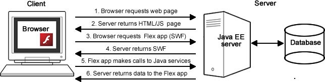
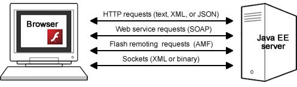

Client/server architecture
==========================

.. toctree::
   :maxdepth: 3
   :caption: java_architecture

Flex and Java applications use a multi-tier architecture where the presentation tier is the Flex application,
the business or application tier is the Java EE server and code, and the data tier is the database.
You can write the back-end code just as you normally would for a Java application, modeling your objects,
defining your database, using an object-relational framework such as Hibernate or EJB 3,
and writing the business logic to query and manipulate these objects.
The business tier must be exposed for access via HTTP from the Flex application and will be used to move the data between the presentation and data tiers.

Typical HTML applications consist of multiple pages and as a user navigates between them, the application data must be passed along so the application itself (the collection of pages and functionality it consists of) can maintain state. In contrast, Flex applications, by nature, are stateful. A Flex application is embedded in a single HTML page that the user does not leave and is rendered by Flash Player. The Flex application can dynamically change views and send and retrieve data asynchronously to the server in the background, updating but never leaving the single application interface (see Figure 1) (similar to the functionality provided by the XMLHttpRequest API with JavaScript.)

**Figure 1**. The client/server architecture. 

Client/server communication
---------------------------

Flex applications can communicate with back-end servers using either direct socket connections or more commonly, through HTTP.
The Flex framework has three remote procedure call APIs that communicate with a server over HTTP: HTTPService, WebService, and RemoteObject.
All three wrap Flash Player's HTTP connectivity, which in turn, uses the browser's HTTP library.
Flex applications cannot connect directly to a remote database.

You use HTTPService to make HTTP requests to JSP or XML files,
to RESTful web services, or to other server files that return text over HTTP.
You specify the endpoint URL, listener functions (the callback functions to be invoked when the HTTPService request returns a successful or unsuccessful response),
and a data type for the returned data (what type of data structure it should be translated into once received in the Flex application).
You can specify the data to be handled as raw text and assigned to a String variable or converted to XML, E4X, or plain old ActionScript objects.
If you get back JSON, you can use the `Adobe Flex corelib <http://code.google.com/p/as3corelib/>`__ package of classes to deserialize the JSON objects into ActionScript objects.
To make calls to SOAP based web services, you can use the HTTPService API or the more specialized WebService API,
which automatically handles the serialization and deserialization of SOAP formatted text to ActionScript data types and vice versa.

The third option for making remote procedure calls is to use the RemoteObject API.
It makes a Flash Remoting request to a method of a server-side Java class that returns binary Action Message Format over HTTP.
When possible, use Flash Remoting whose binary data transfer format enables applications to load data up to 10 times faster than with the more verbose,
text-based formats such as XML, JSON, or SOAP (see Figure 2).
To see a comparison of AMF to other text-based serialization technologies,
see `James Ward's Census RIA Benchmark application <http://www.jamesward.org/census>`__.

**Figure 2**. Methods for connecting Flex and Java.
